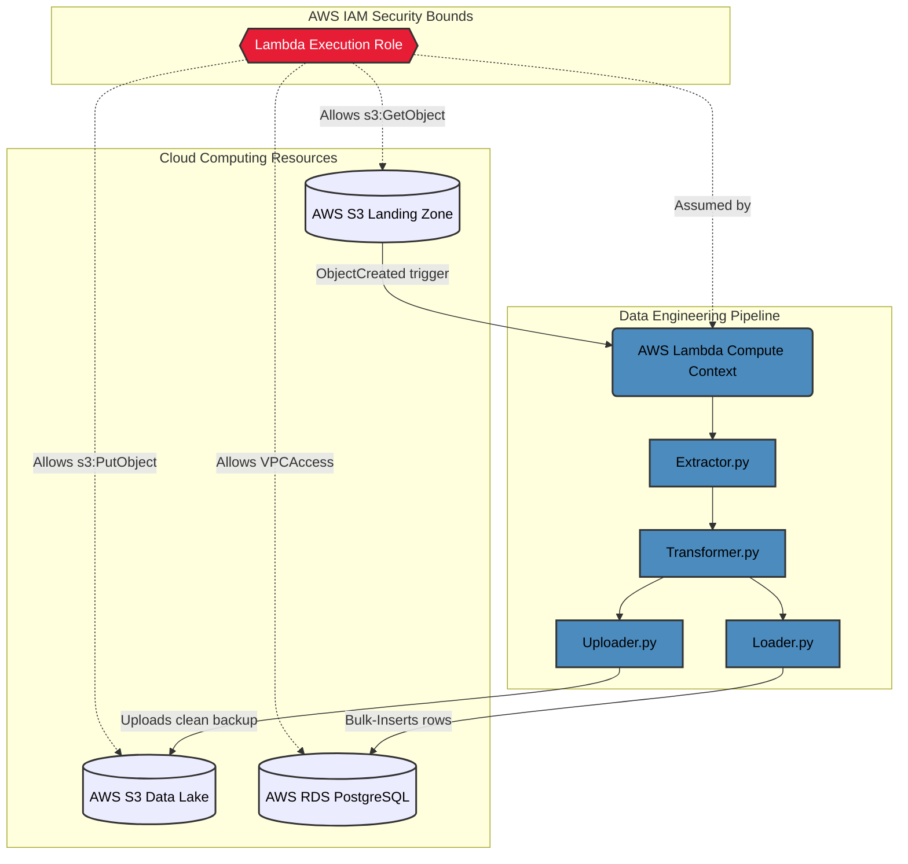

## ShopFlow Cloud Architecture

With an event-driven design, the Cloud Infrastructure handles the hardware scaling, networking, and event orchestration, while the Data Engineering pipeline remains fully isolated, focusing exclusively on data extraction, transformation, and loading.

### IAM Authorization & Security Model
ShopFlow utilizes a strictly scoped security model orchestrated through Terraform (`iam.tf`):
1. **Lambda Execution Role (`shopflow-lambda-exec-role`):** The AWS Lambda function assumes this role instantly when triggered.
2. **S3 Permissions:** The role must contain policies allowing `s3:GetObject` to pull the raw CSV from the bucket, and crucially, `s3:PutObject` to push the processed Data Lake backup back to the `processed/` prefix.
3. **VPC Networking (`AWSLambdaVPCAccessExecutionRole`):** Because the RDS instance sits securely inside a Virtual Private Cloud (VPC), the Lambda role must have VPC Access permissions to generate elastic network interfaces (ENIs) to reach the Database on port `5432`.
4. **Invocation Scopes:** S3 is granted selective permission to invoke the Lambda function, ensuring only your specific bucket triggers the pipeline.
