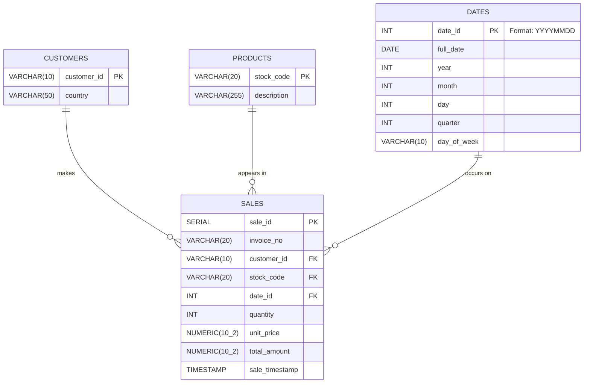

### Database ER Diagram

```mermaid
erDiagram
    %% Entities
    CUSTOMERS {
        VARCHAR(10) customer_id PK
        VARCHAR(50) country
    }
    
    PRODUCTS {
        VARCHAR(20) stock_code PK
        VARCHAR(255) description
    }
    
    DATES {
        INT date_id PK "Format: YYYYMMDD"
        DATE full_date
        INT year
        INT month
        INT day
        INT quarter
        VARCHAR(10) day_of_week
    }
    
    SALES {
        SERIAL sale_id PK
        VARCHAR(20) invoice_no
        VARCHAR(10) customer_id FK
        VARCHAR(20) stock_code FK
        INT date_id FK
        INT quantity
        NUMERIC(10_2) unit_price
        NUMERIC(10_2) total_amount
        TIMESTAMP sale_timestamp
    }

    %% Relationships
    CUSTOMERS ||--o{ SALES : "makes"
    PRODUCTS ||--o{ SALES : "appears in"
    DATES ||--o{ SALES : "occurs on"
```