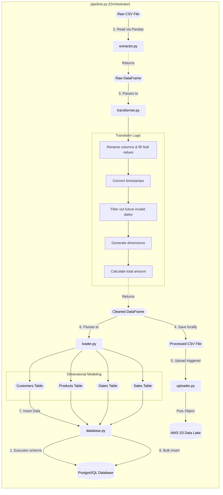

# ShopFlow Python ETL Execution & Flow

This diagram illustrates the step-by-step logic and class interactions defined inside the `src/shopflow/` source code. It outlines how raw data moves through the pipeline and ultimately lands in the database schemas.

### Flow Breakdown:
1. **Initialize Database:** `pipeline.py` starts by initializing the `Database` class, which connects to PostgreSQL and runs `./sql/schema.sql` to ensure tables (customers, products, dates, sales) exist.
2. **Extraction (`extractor.py`):** Uses pandas to read the raw `.csv` file directly from a filepath (either local or downloaded by Lambda), raising errors immediately if parsing fails.
3. **Transformation (`transformer.py`):** Accepts the raw DataFrame and systematically cleans it. This includes normalizing column names, safely replacing NULL IDs, enforcing date validation, and computing business-logic features (like `day_of_week` and `total_amount`).
4. **Data Backup (`uploader.py`):** The clean DataFrame is extracted back to a flat CSV file, which `uploader.py` then immediately uploads to Amazon S3 as a backup in the "Processed Data Lake", saving to S3 occurs if the pipeline is triggered by an uplaod.
5. **Loading (`loader.py` & `database.py`):** `loader.py` slices the singular clean DataFrame into distinct tables to enforce a Star Schema. By running `drop_duplicates` on primary keys, it guarantees data integrity before passing the subsets to `database.py`, which leverages `psycopg2.extras.execute_values` for high-speed batch database loading.
